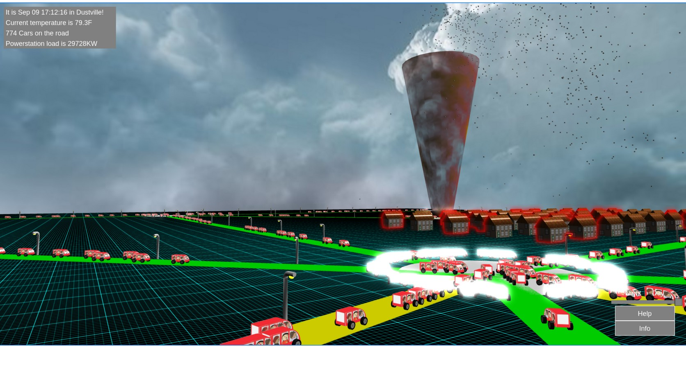

Dustville
=========

Dustville is a toy digital twinning system using Dust Actors (see dust-core). 

Be sure to have built dust-core to get dependencies then

    ./gradlew run

After which point your browser at.

http://localhost:9090/views/babylon.html

Help and a paper describing the structure of the app is available through the UI:

